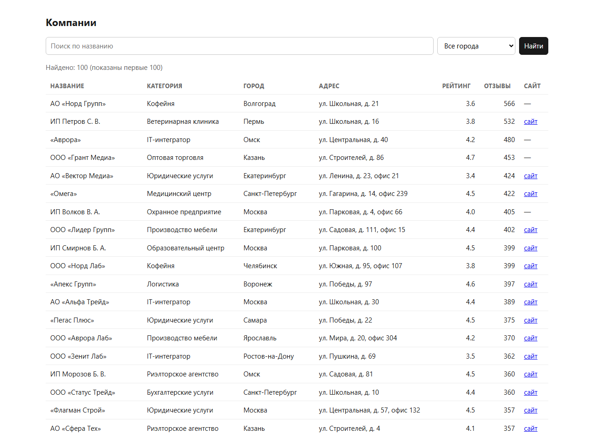
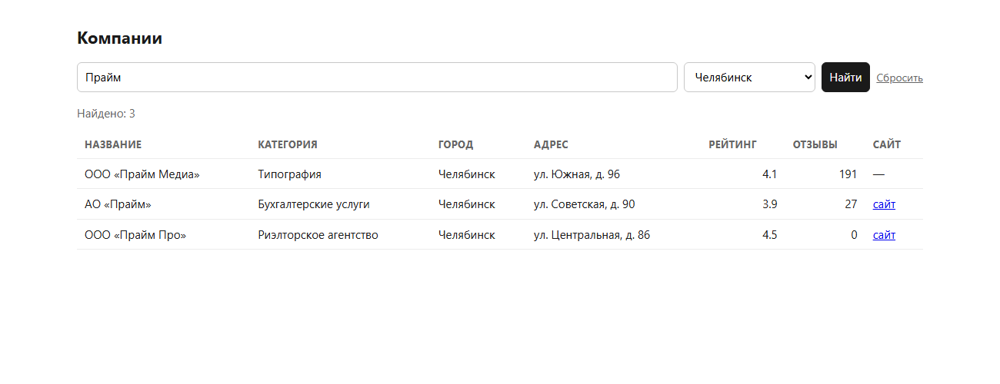

# Выгрузка данных

Загрузка выгрузки внутреннего API из zip-архива
в PostgreSQL

## Запуск

```bash
pip install psycopg2-binary
docker compose up -d          # postgres:17 на localhost:5432, БД companies
python load.py                # берёт ./data_pack.zip, создаёт схему и грузит (идемпотентно)
python load.py путь/к/пачке.zip
docker compose exec -T db psql -U postgres -d companies -f - < queries.sql
```

На вход — только `.zip`
Внутри ищутся `page_*.json` и `review.csv` по имени файла

## Схема

Одна таблица `companies` (`schema.sql`): `id` — первичный ключ и единственный ключ дедупликации,
индекс по `category` и частичный индекс `(city, rating) where reviews_count >= 10` под запрос №2.
Повторный запуск `load.py` обновляет записи через `on conflict (id) do update`.

## Запросы (`queries.sql`)

1. Топ-5 категорий по числу компаний.
2. Средний рейтинг по городам среди компаний с 10+ отзывами.
3. Доля компаний с сайтом по категориям.

Цифры сняты с текущей базы — 1189 компаний, `page_*.json` плюс `review.csv`.

**1. Топ-5 категорий по числу компаний**

| category | companies |
|---|---|
| IT-интегратор | 112 |
| Оптовая торговля | 93 |
| Рекламное агентство | 90 |
| Строительная компания | 88 |
| Юридические услуги | 72 |

**2. Средний рейтинг по городам (10+ отзывов)**

По городам рейтинг почти не гуляет: 4.08–4.43. Верхние три строки к городам отношения не имеют,
это мусор из `review.csv` по одной компании в каждой: `Санкат-Петербург`, `Moscow`, `москва`
(см. [ANOMALIES.md](ANOMALIES.md)). Запрос их не склеивает, поэтому они и всплыли наверх.

<details>
<summary>23 строки</summary>

| city | avg_rating | companies |
|---|---:|---:|
| Санкат-Петербург | 4.70 | 1 |
| Moscow | 4.50 | 1 |
| Омск | 4.43 | 26 |
| Пермь | 4.43 | 33 |
| Сочи | 4.36 | 16 |
| Тюмень | 4.36 | 27 |
| Воронеж | 4.32 | 34 |
| Уфа | 4.32 | 39 |
| Екатеринбург | 4.31 | 60 |
| Нижний Новгород | 4.31 | 57 |
| Ростов-на-Дону | 4.31 | 43 |
| Новосибирск | 4.30 | 76 |
| Казань | 4.29 | 50 |
| Самара | 4.29 | 39 |
| Краснодар | 4.28 | 60 |
| Санкт-Петербург | 4.27 | 122 |
| Москва | 4.24 | 210 |
| Волгоград | 4.22 | 36 |
| Челябинск | 4.17 | 35 |
| Калуга | 4.14 | 5 |
| Тула | 4.10 | 7 |
| Ярославль | 4.08 | 6 |
| москва | 4.00 | 1 |

</details>

**3. Доля компаний с сайтом по категориям**

Сайт есть у 62–85% компаний в зависимости от категории

<details>
<summary>22 строки</summary>

| category | total | with_site | pct_with_site |
|---|---:|---:|---:|
| Ресторан | 48 | 41 | 85.4 |
| Клининг | 20 | 17 | 85.0 |
| Производство мебели | 52 | 43 | 82.7 |
| Юридические услуги | 72 | 58 | 80.6 |
| IT-интегратор | 112 | 90 | 80.4 |
| Фитнес-клуб | 25 | 20 | 80.0 |
| Пекарня | 29 | 23 | 79.3 |
| Бухгалтерские услуги | 62 | 49 | 79.0 |
| Логистика | 56 | 44 | 78.6 |
| Риэлторское агентство | 45 | 35 | 77.8 |
| Автосервис | 51 | 39 | 76.5 |
| Образовательный центр | 54 | 41 | 75.9 |
| Охранное предприятие | 37 | 28 | 75.7 |
| Рекламное агентство | 90 | 67 | 74.4 |
| Ветеринарная клиника | 23 | 17 | 73.9 |
| Кофейня | 36 | 26 | 72.2 |
| Медицинский центр | 65 | 46 | 70.8 |
| Салон красоты | 40 | 28 | 70.0 |
| Оптовая торговля | 93 | 65 | 69.9 |
| Стоматология | 59 | 40 | 67.8 |
| Строительная компания | 88 | 59 | 67.0 |
| Типография | 32 | 20 | 62.5 |

</details>

## Страница `/companies`

Next.js (App Router), Server Component: SQL уходит в Postgres на сервере, в браузер едет готовый
html

```bash
npm install
cp .env.example .env.local      # строка подключения, .env.local в .gitignore
npm run dev                     # http://localhost:3000/companies
```





### Как проверял

Сверкой с `count(*)` в базе: `q=Прайм` — 28 и 28, он же с Челябинском — 3 и 3,
один Челябинск — 36 и 36. По пустой выдаче добавил «Ничего не найдено». На `?q='; drop table companies;--` приходит 200, таблица цела.
Скриншоты — с production-сборки (`npm run build && npm start`), чтобы в кадр не лез dev-индикатор.
